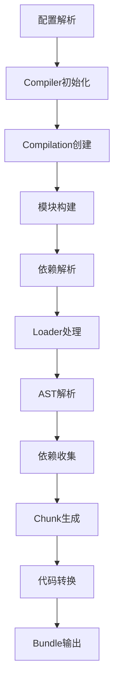

# Splitting Webpack

[](./package.json)
[](./package.json)
[](./package.json)
[](./LICENSE)

> 一个用于深入学习和理解 Webpack 核心机制的项目，通过从零实现完整的模块打包器来掌握现代前端构建工具的底层原理。

## ✨ 功能特性

### 🏗️ 完整构建管道

- ✅ **模块解析**: 支持相对路径、绝对路径、扩展名推断
- ✅ **依赖收集**: ES6 import/export 语法解析和依赖图构建
- ✅ **Loader系统**: 文件转换和处理管道
- ✅ **插件系统**: 基于 Tapable 的生命周期钩子
- ✅ **代码生成**: ES6 → CommonJS 转换和 Bundle 输出
- ✅ **文件输出**: 智能目录管理和文件写入

### 🔧 内置 Loader (6个)

| Loader         | 功能                 | 状态 |
| -------------- | -------------------- | ---- |
| `babel-loader` | JavaScript/ES6+ 转换 | ✅   |
| `ts-loader`    | TypeScript 编译      | ✅   |
| `css-loader`   | CSS 模块化处理       | ✅   |
| `json-loader`  | JSON 文件解析        | ✅   |
| `url-loader`   | 资源内联/引用处理    | ✅   |
| `raw-loader`   | 原始文件内容处理     | ✅   |

### 🔌 内置插件 (4个)

| 插件                 | 功能            | 状态 |
| -------------------- | --------------- | ---- |
| `DefinePlugin`       | 全局变量定义    | ✅   |
| `BannerPlugin`       | Bundle 头部注释 | ✅   |
| `ProgressPlugin`     | 构建进度显示    | ✅   |
| `CleanWebpackPlugin` | 输出目录清理    | ✅   |

### 🛠️ 开发工具

- ✅ **CLI 工具**: 完整的命令行界面
- ✅ **配置系统**: 灵活的配置文件支持
- ✅ **错误处理**: 详细的错误报告和日志
- ✅ **构建统计**: 模块数量、文件大小、构建时间

## 🚀 快速开始

### 一键演示

````bash
# 克隆项目
git clone https://github.com/narcilee7/splitting-webpack.git
cd splitting-webpack

# 安装依赖
pnpm install

```bash
# 克隆项目
git clone https://github.com/narcilee7/splitting-webpack.git
cd splitting-webpack

# 安装依赖
pnpm install

# 构建项目
pnpm run build
````

### 创建测试项目

```bash
# 创建项目目录
mkdir my-project && cd my-project

# 创建源码文件
mkdir src
```

**src/index.js**

```javascript
import { add } from './math.js'
import { greeting } from './utils.js'

console.log(greeting('Splitting Webpack'))
console.log('计算结果:', add(1, 2))
```

**src/math.js**

```javascript
export function add(a, b) {
  return a + b
}

export function multiply(a, b) {
  return a * b
}
```

**src/utils.js**

```javascript
export function greeting(name) {
  return `Hello, ${name}! 🚀`
}

export function formatTime() {
  return new Date().toLocaleString()
}
```

**splitting-webpack.config.js**

```javascript
export default {
  entry: './src/index.js',
  output: {
    path: './dist',
    filename: 'bundle.js'
  },
  mode: 'development'
}
```

### 运行构建

```bash
# 使用 splitting-webpack 构建项目
node path/to/splitting-webpack/dist/cli.js build -c splitting-webpack.config.js

# 运行生成的 bundle
node ./dist/bundle.js
```

**输出结果:**

```
Hello, Splitting Webpack! 🚀
计算结果: 3
```

## 📖 架构设计

### 核心构建流程



### 文件架构

```
src/
├── 📁 cli.ts                    # CLI 入口点
├── 📁 index.ts                  # 程序化 API
├── 📁 types/                    # TypeScript 类型定义
│   ├── config.ts                # 配置类型
│   ├── compiler.ts              # 编译器类型
│   ├── module.ts                # 模块类型
│   └── chunk.ts                 # Chunk 类型
├── 📁 config/                   # 配置系统
│   ├── configResolver.ts        # 配置解析器
│   ├── default.ts               # 默认配置
│   └── schema.ts                # 配置验证
├── 📁 compiler/                 # 核心编译器
│   ├── Compiler.ts              # 主编译器
│   ├── Compilation.ts           # 编译过程
│   └── Stats.ts                 # 构建统计
├── 📁 resolver/                 # 模块解析
│   └── Resolver.ts              # 路径解析器
├── 📁 loader/                   # Loader 系统
│   ├── LoaderRunner.ts          # Loader 运行器
│   └── builtin/                 # 内置 Loader
├── 📁 parser/                   # AST 解析
│   ├── Parser.ts                # 代码解析器
│   └── DependencyCollector.ts   # 依赖收集器
├── 📁 chunk/                    # Chunk 处理
│   ├── ChunkGraph.ts            # Chunk 图生成
│   └── CodeGenerator.ts         # 代码生成器
├── 📁 runtime/                  # 运行时
│   └── template.ts              # Bundle 模板
├── 📁 plugins/                  # 插件系统
│   ├── DefinePlugin.ts          # 变量定义插件
│   ├── BannerPlugin.ts          # 横幅插件
│   ├── ProgressPlugin.ts        # 进度插件
│   └── CleanWebpackPlugin.ts    # 清理插件
├── 📁 tapable/                  # 钩子系统
│   ├── SyncHook.ts              # 同步钩子
│   └── AsyncSeriesHook.ts       # 异步钩子
└── 📁 utils/                    # 工具函数
    ├── fs.ts                    # 文件系统
    ├── hash.ts                  # 哈希计算
    └── cache.ts                 # 缓存管理
```

## 🎯 当前状态

### ✅ 已完成功能 (v0.1.0 级别)

- **核心构建**: 完整的模块解析、依赖收集、代码转换流程
- **Loader系统**: 6个内置 Loader，支持 JavaScript、TypeScript、CSS、JSON、资源文件
- **插件系统**: 4个内置插件，完整的生命周期钩子
- **CLI工具**: 功能完整的命令行界面
- **实战验证**: 能够成功构建并运行真实的 ES6 模块项目

### 🚧 开发中功能

- **Source Map**: 调试信息生成
- **开发服务器**: 实时预览和热更新
- **代码分割**: 多入口和动态导入支持
- **优化功能**: Tree shaking、代码压缩

## 📚 文档

- [📋 开发任务](./docs/TASKS.md) - 详细的开发计划和任务分解
- [🗺️ 项目路线图](./docs/ROADMAP.md) - 版本规划和功能规划
- [📝 更新日志](./docs/CHANGELOG.md) - 版本变更记录

## 🤝 贡献

欢迎贡献代码、报告问题或提出建议！

1. Fork 项目
2. 创建功能分支 (`git checkout -b feature/AmazingFeature`)
3. 提交更改 (`git commit -m 'Add some AmazingFeature'`)
4. 推送到分支 (`git push origin feature/AmazingFeature`)
5. 打开 Pull Request

## 📄 许可证

本项目采用 [ISC](./LICENSE) 许可证。

## 🙏 致谢

感谢 Webpack 团队提供的灵感和技术方案，本项目纯属学习目的，向所有现代前端构建工具的开发者致敬。

---

<div align="center">

**[🏠 首页](https://github.com/narcilee7/splitting-webpack)** •
**[📖 文档](./docs/)** •
**[🐛 问题](https://github.com/narcilee7/splitting-webpack/issues)** •
**[💡 讨论](https://github.com/narcilee7/splitting-webpack/discussions)**

</div>
